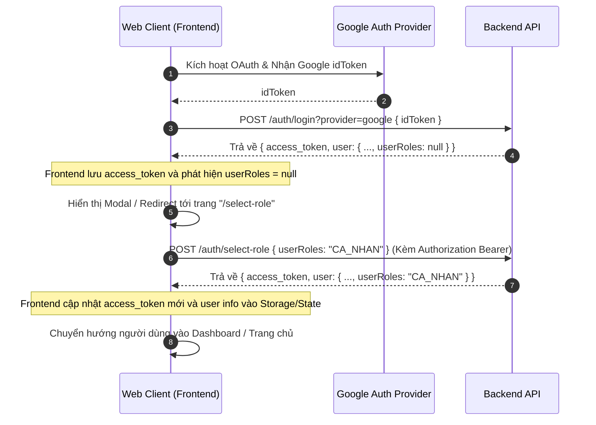
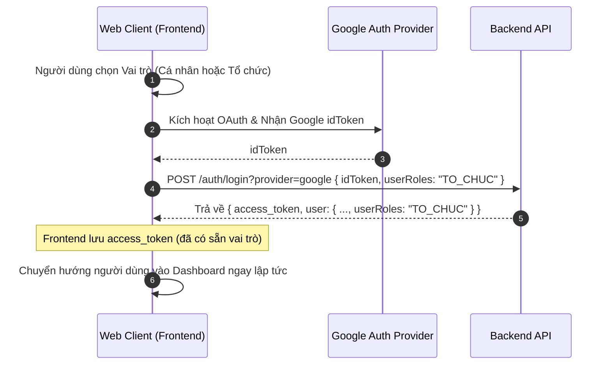

# Luồng Đăng Nhập Google và Chọn Vai Trò (Frontend Web)

Tài liệu này hướng dẫn chi tiết cách tích hợp luồng đăng nhập Google và chọn vai trò (`userRoles` là `CA_NHAN` hoặc `TO_CHUC`) cho ứng dụng Web Client (React, Vue, Angular, v.v.).

---

## 1. Tổng Quan Kịch Bản

Khi người dùng đăng nhập bằng Google, hệ thống Backend sẽ kiểm tra tài khoản:
1. Nếu tài khoản đã tồn tại và đã có vai trò (`userRoles` khác `null`), đăng nhập thành công và đi vào Dashboard.
2. Nếu tài khoản đăng nhập Google lần đầu (chưa có vai trò trong hệ thống):
   - **Kịch bản A (Chọn sau)**: Người dùng nhấn nút đăng nhập nhanh bằng Google từ trang Login thông thường. Sau khi đăng nhập, hệ thống phát hiện vai trò là `null` và hiển thị Modal/Trang yêu cầu người dùng chọn vai trò để tiếp tục hoàn thiện tài khoản.
   - **Kịch bản B (Chọn trước)**: Người dùng chọn vai trò "Cá nhân" hoặc "Tổ chức" từ trang Đăng ký (Register) trước khi bấm nút "Đăng ký với Google". Thông tin vai trò được gửi đi ngay trong request đăng nhập đầu tiên.

---

## 2. Sơ Đồ Tuần Tự (Sequence Diagrams)

### Kịch Bản A: Chọn Vai Trò Sau Khi Xác Thực Google (Đăng nhập nhanh)



### Kịch Bản B: Chọn Vai Trò Trước Khi Xác Thực Google (Trang Đăng Ký)



---

## 3. Hướng Dẫn Tích Hợp Chi Tiết (React Example)

Dưới đây là gợi ý cấu trúc code xử lý logic đăng nhập trên frontend (React hook/context).

### Bước 1: Gọi API Đăng Nhập Google

Gửi request đăng nhập Google kèm theo `userRoles` nếu người dùng đã lựa chọn trước:

```typescript
import axios from 'axios';

interface LoginResponse {
  access_token: string;
  refresh_token: string;
  user: {
    id: string;
    email: string;
    fullname: string;
    avatar?: string;
    role: string;       // ADMIN | USER
    userRoles: string | null; // CA_NHAN | TO_CHUC | null
  };
}

export const loginWithGoogle = async (idToken: string, preSelectedRole?: 'CA_NHAN' | 'TO_CHUC') => {
  const response = await axios.post<LoginResponse>(
    'http://localhost:3000/auth/login?provider=google', 
    {
      idToken,
      userRoles: preSelectedRole // Có thể undefined
    }
  );
  return response.data;
};
```

### Bước 2: Xử Lý Lưu Trữ & Điều Hướng

Khi nhận được phản hồi đăng nhập:

```typescript
import { useNavigate } from 'react-router-dom';

const handleLoginSuccess = (data: LoginResponse) => {
  // 1. Lưu token và thông tin user vào localStorage / Cookies
  localStorage.setItem('access_token', data.access_token);
  localStorage.setItem('refresh_token', data.refresh_token);
  localStorage.setItem('user_info', JSON.stringify(data.user));

  // 2. Kiểm tra nếu chưa chọn vai trò
  if (!data.user.userRoles) {
    // Chuyển hướng đến màn hình chọn vai trò hoặc mở Modal bắt buộc chọn
    navigate('/select-role', { replace: true });
  } else {
    // Đã có vai trò, đi thẳng vào Dashboard
    navigate('/dashboard', { replace: true });
  }
};
```

### Bước 3: Gọi API Cập Nhật Vai Trò

Tại trang `/select-role`, hiển thị 2 lựa chọn: **Cá nhân (CA_NHAN)** và **Tổ chức (TO_CHUC)**. Khi người dùng xác nhận lựa chọn, thực hiện gọi API chọn vai trò:

```typescript
import axios from 'axios';

interface SelectRoleResponse {
  access_token: string;
  user: {
    id: string;
    email: string;
    fullname: string;
    avatar?: string;
    role: string;
    userRoles: 'CA_NHAN' | 'TO_CHUC';
  };
}

export const submitSelectedRole = async (selectedRole: 'CA_NHAN' | 'TO_CHUC') => {
  const accessToken = localStorage.getItem('access_token');
  
  const response = await axios.post<SelectRoleResponse>(
    'http://localhost:3000/auth/select-role',
    {
      userRoles: selectedRole
    },
    {
      headers: {
        Authorization: `Bearer ${accessToken}`
      }
    }
  );

  // Cập nhật lại access token mới và thông tin user trong LocalStorage
  localStorage.setItem('access_token', response.data.access_token);
  localStorage.setItem('user_info', JSON.stringify(response.data.user));

  return response.data.user;
};
```

---

## 4. Các Lưu Ý Về UX/Bảo Mật

1. **Chặn Chuyển Hướng Trái Phép**: Nếu người dùng đăng nhập bằng Google nhưng chưa chọn vai trò (`userRoles === null`), hệ thống Routing (Route Guards) trên Web Client cần chặn không cho họ truy cập vào các trang tính năng chính (`/dashboard`, `/sessions`, v.v.) và luôn tự động redirect về trang `/select-role` cho đến khi vai trò được lưu thành công.
2. **Xử Lý Lỗi**: API `/auth/select-role` kiểm tra rất nghiêm ngặt ở phía Backend: chỉ cho phép chọn vai trò **1 lần duy nhất** khi trường này trong cơ sở dữ liệu đang là `null`. Nếu người dùng tìm cách gọi lại API này khi tài khoản đã có vai trò, backend sẽ trả về lỗi `400 Bad Request` với thông báo `"Tài khoản đã được thiết lập vai trò"`. Hãy hiển thị thông báo lỗi phù hợp trên màn hình.
3. **Mã hóa Token**: Access Token mới được trả về sau khi chọn vai trò chứa thông tin payload mới bao gồm `userRoles`. Giúp cho Client giải mã token trực tiếp (nếu sử dụng thư viện như `jwt-decode`) để đọc thông tin vai trò một cách chính xác mà không cần gọi thêm API.
